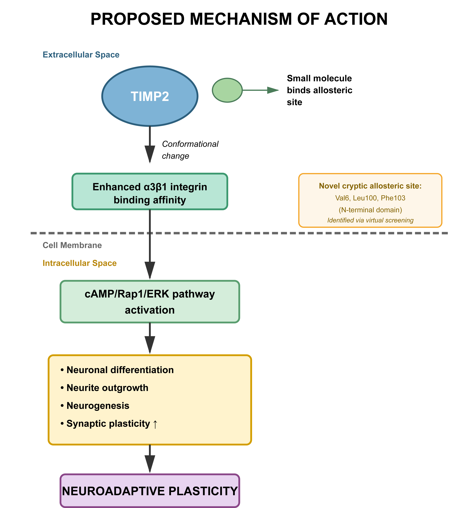

# TIMP2 Docking and ADMET Pipeline
*A computational framework for identifying novel allosteric modulators of TIMP2 and exploring mechanisms of neuroplasticity.*

---

## Overview
This repository contains all custom Python scripts, documentation, and supporting materials for the study:

> **Curry, J.D. (2025).**  
> *Large-Scale Virtual Screening Identifies Novel Allosteric Modulators of TIMP2:  
> A Computational Approach to Enhancing Neuroplasticity.*  
> (Preprint forthcoming on OSF)

TIMP2 (Tissue Inhibitor of Metalloproteinase-2) regulates hippocampal plasticity and cognitive function through MMP-independent neuronal signaling.  
Building on Ferreira *et al.* (2023, *eNeuro*) and integrin-mechanistic studies by Pérez-Martínez & Jaworski (2005) and Herrera-Molina *et al.* (2012), this project identifies a cryptic, chemically promiscuous allosteric pocket in TIMP2 and demonstrates that it accommodates both halogenated and non-halogenated scaffolds with high CNS drug-likeness.

---

## Biological Context

TIMP2 modulates neural plasticity through dual integrin-dependent signaling systems that together maintain a dynamic balance between neurite growth and retraction.

- **Pérez-Martínez & Jaworski (2005)** showed that TIMP2 activates neuronal **α3β1 integrin**, stimulating the **cAMP/Rap1/ERK** cascade and promoting neurite outgrowth and differentiation — a growth-promoting, pro-plasticity pathway independent of metalloproteinase inhibition.  
- **Herrera-Molina *et al.* (2012)** revealed that astrocytic **αVβ3 integrin** binds neuronal **Thy-1**, triggering **Src inactivation and neurite retraction**, defining an opposing, retractive mechanism relevant to axonal remodeling and glial responses.  
- **Ferreira *et al.* (2023)** confirmed *in vivo* that neuronal TIMP2 is essential for hippocampal neurogenesis and memory formation, directly linking these integrin pathways to cognitive function.

Together, these findings describe a **bidirectional integrin–matrix feedback loop**:  
TIMP2–α3β1 drives neuronal growth and synaptic plasticity, whereas Thy-1–αVβ3 constrains or reverses it during glial activation.  
The cryptic allosteric site discovered in this project may stabilize TIMP2’s pro-plasticity conformation and tip this balance toward regeneration.

---

## Proposed Mechanism of Action



**Figure 1. ** *Proposed mechanism of action for TIMP2 allosteric modulation.*  
Binding of a small molecule to the cryptic N-terminal pocket (Val6, Leu100, Phe103) induces a conformational shift enhancing TIMP2’s affinity for α3β1 integrins.  
This promotes downstream activation of the **cAMP/Rap1/ERK** pathway, leading to increased neurite outgrowth, neurogenesis, and synaptic plasticity.

*References:*  
- Pérez-Martínez L. & Jaworski D.M. (2005). *TIMP-2 promotes neuronal differentiation and neurite outgrowth through α3β1 integrin and ERK signaling.* *J Neurosci.* 25 (26): 7997–8007.  
- Herrera-Molina R. *et al.* (2012). *The integrin αVβ3 interacts with Thy-1 and regulates neurite outgrowth in hippocampal neurons.* *PLoS ONE 7* (4): e34295.  
- Ferreira T.A. *et al.* (2023). *Neuronal TIMP2 regulates hippocampal neurogenesis and synaptic plasticity.* *eNeuro 10* (4): ENEURO.0031-23.2023.

---

## Pipeline Summary

| Step | Script | Function |
|------|---------|-----------|
| 1️⃣ | `dock_adaptive_fixed.py` | Adaptive AutoDock Vina screening with CPU benchmarking. |
| 2️⃣ | `rebuild_hits.py` | Parses `.pdbqt` files to rebuild SMILES and docking scores. |
| 3️⃣ | `timp2_triage.py` | Triage CNS/peripheral hits; energy and diversity filters. |
| 4️⃣ | `timp2_analysis.py` | Integrates ADMET data, CNS MPO, and scaffold clustering. |
| 5️⃣ | `add_zinc_ids_prioritized.py` | Re-maps prioritized compounds to ZINC IDs. |
| 6️⃣ | `tier_1_filter.py` | Strict ADMET-AI toxicity tiers (Tier 1 = clean). |
| 7️⃣ | `diversity_selection_script.py` | Balances chemical diversity across chunks. |
| 8️⃣ | `singleton.py` | Identifies unique (singleton) scaffolds. |
| 9️⃣ | `scaffold_extraction_rdkit.py` | Generates Murcko scaffold images. |

---

## Computational Setup

**Hardware:** Dual Xeon (24 cores, 128 GB RAM), NVMe SSD, Ubuntu 22.04  
**Software:** AutoDock Vina 1.2.5, RDKit 2023.03, OpenBabel 3.1.1, ADMET-AI v2.1  

Create environment:
```bash
conda env create -f environment.yml
conda activate timp2-docking

Example run:

python scripts/dock_adaptive_fixed.py data/strict_0001.smi
python scripts/rebuild_hits.py
python scripts/timp2_triage.py --hits-csv work_strict/strict_0001_hits.csv --out triage_out/strict_0001
python scripts/timp2_analysis.py triage_out/strict_0001/cns_hits.csv -o analysis_out/
